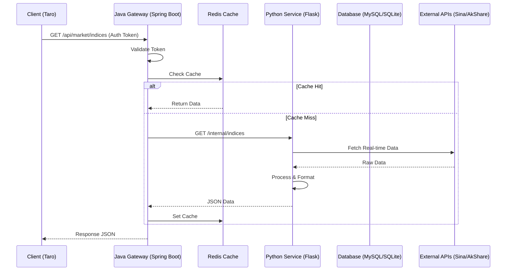

# Stock Agent System Architecture

**Version**: 1.0.0  
**Author**: Stock Agent Team  
**Date**: 2024-05-22  
**Status**: Draft  

## 1. System Overview
The Stock Agent system is a hybrid architecture application designed for real-time A-share market monitoring, high-dividend stock tracking, and index analysis. It leverages **Java Spring Boot** for robust business logic and gateway services, and **Python Flask** for heavy data processing and algorithm execution. The frontend is a cross-platform application (Web + WeChat Mini Program) built with **Taro (React)**.

## 2. Backend Responsibilities & Boundaries

### 2.1 Java Backend (`stock-backend`)
**Role**: Enterprise Gateway & Business Core
*   **Domain**: User Management, Watchlist, System Configuration, API Gateway.
*   **Tech Stack**: 
    *   Framework: Spring Boot 3.x
    *   ORM: MyBatis-Plus
    *   Database Sharding: ShardingSphere (Planned for scale)
    *   Security: Spring Security + JWT
*   **Core Modules**:
    *   `AuthController`: User login, registration, JWT issuance.
    *   `MarketController`: Proxy for market data, aggregation of data sources.
    *   `UserController`: User profile, favorites/watchlist management.
*   **Key Responsibilities**:
    *   **Unified Gateway**: All client requests go through Java.
    *   **Authentication**: Validates JWT tokens before forwarding requests.
    *   **Rate Limiting & Circuit Breaking**: Protects downstream Python services (Resilience4j).
    *   **Caching**: Redis-based caching for high-frequency index data.

### 2.2 Python Backend (`backend`)
**Role**: Data Engine & AI Services
*   **Domain**: Market Data Acquisition, Quantitative Analysis, AI Models.
*   **Tech Stack**: 
    *   Web: Flask / Gunicorn
    *   Data: Pandas, AkShare, NumPy
    *   Task Queue: Celery + Redis (Planned)
*   **Core Modules**:
    *   `stock_service`: Real-time stock metrics (Price, Dividend Yield TTM).
    *   `scanner_service`: Market-wide scanning logic.
    *   `scheduler`: Cron jobs for daily data fetching.
*   **Key Responsibilities**:
    *   **Data Fetching**: Interfacing with Sina, EastMoney via AkShare.
    *   **Computation**: Calculating complex indicators (e.g., Dividend Yield based on historical dividends).
    *   **AI/Model**: (Future) Sentiment analysis, price prediction models.

## 3. Data Flow & Interface Contracts

### 3.1 Data Flow Diagram

### 3.2 Interface Contracts
*   **Protocol**: RESTful API (JSON)
*   **Gateway**: Spring Cloud Gateway (or embedded Zuul/Spring MVC proxy)
*   **Authentication**: Bearer Token (JWT)
*   **Version Control**: URL Path Versioning (e.g., `/api/v1/...`)
*   **Error Codes**:
    *   `200`: Success
    *   `401`: Unauthorized
    *   `403`: Forbidden
    *   `500`: Internal Server Error
    *   `1001`: Business Logic Error (with message)

## 4. Database Schema (Simplified ER)

### Tables
1.  **users**
    *   `id` (BigInt, PK)
    *   `username` (Varchar)
    *   `password_hash` (Varchar)
    *   `wechat_openid` (Varchar)
2.  **user_watchlist**
    *   `id` (BigInt, PK)
    *   `user_id` (BigInt, FK)
    *   `symbol` (Varchar)
    *   `created_at` (Timestamp)
3.  **stock_daily_metrics** (Managed by Python, Read by Java)
    *   `date` (Date, PK)
    *   `symbol` (Varchar, PK)
    *   `close_price` (Decimal)
    *   `dividend_yield` (Decimal)
    *   `pe_ratio` (Decimal)

## 5. Deployment Topology
*   **Containerization**: Docker + Kubernetes (k8s)
*   **Namespace**: `stock-agent-prod`
*   **Services**:
    *   `ingress-nginx`: Load Balancer & SSL Termination.
    *   `java-backend-svc`: ClusterIP, scaled via HPA (CPU > 70%).
    *   `python-backend-svc`: ClusterIP, fixed replicas (dependent on external API rate limits).
    *   `redis-svc`: StatefulSet.
    *   `db-svc`: StatefulSet (or Cloud RDS).

## 6. Security & Compliance
*   **Transport**: TLS 1.3 enforced for all external traffic.
*   **Data Privacy**: Phone numbers and OpenIDs are encrypted at rest.
*   **Compliance**: GDPR compliant user data deletion endpoints.
*   **Audit**: All write operations logged to ELK stack.

## 7. Frontend Architecture (New)
*   **Framework**: Taro 3.x (React)
*   **Platforms**: WeChat Mini Program, H5 (Web)
*   **State Management**: Redux Toolkit (Persistent)
*   **UI Library**: Taro UI / Tailwind CSS
*   **CI/CD**: GitHub Actions -> Wechat CI / Vercel

